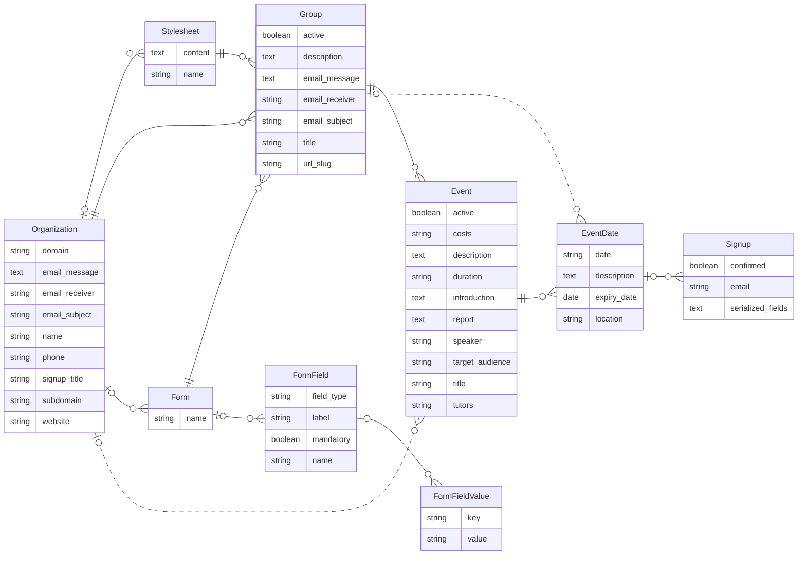
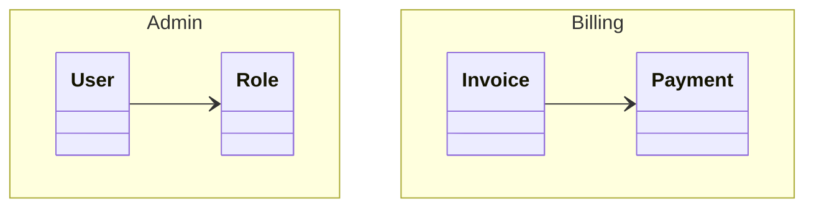
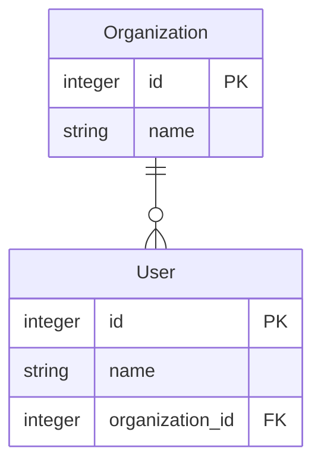

Rails ERD - Generate Entity-Relationship Diagrams for Rails applications
========================================================================
[](https://github.com/voormedia/rails-erd/actions/workflows/test.yml) [](https://codeclimate.com/github/voormedia/rails-erd)

[Rails ERD](https://voormedia.github.io/rails-erd/) is a gem that allows you to easily generate a diagram based on your application's Active Record models. The diagram gives an overview of how your models are related. Having a diagram that describes your models is perfect documentation for your application.

The second goal of Rails ERD is to provide you with a tool to inspect your application's domain model. If you don't like the default output, it is very easy to use the API to build your own diagrams.

Rails ERD was created specifically for Rails and works on versions 6.0 and later (including Rails 7.x and 8.x). It uses Active Record's built-in reflection capabilities to figure out how your models are associated.


Preview
-------

Since version 2.0, Rails ERD generates [Mermaid](https://mermaid.js.org/) diagrams by default, which render natively on GitHub. Here's a diagram generated from the Event Forms application — one of Rails ERD's bundled examples (the dotted lines are indirect `has_many :through` relationships):



Rails ERD can also produce richly styled diagrams with Graphviz (PDF/PNG/SVG):


Browse the [gallery](https://voormedia.github.io/rails-erd/gallery.html) for more example diagrams.


Requirements
---------------

* Ruby 3.1+
* ActiveRecord 7.0+
* Graphviz 2.22+ (optional - only needed for PDF/PNG output)

Getting started
---------------

See the [installation instructions](https://voormedia.github.io/rails-erd/install.html) for a complete description of how to install Rails ERD. Here's a summary:

* Add <tt>gem 'rails-erd', group: :development</tt> to your application's Gemfile

* Run <tt>bundle exec erd</tt>

This generates a Mermaid diagram (`erd.mmd`) by default. Mermaid diagrams render natively in GitHub, GitLab, and many documentation tools.

**For PDF/PNG output (optional):**

* Install Graphviz 2.22+ ([how?](https://voormedia.github.io/rails-erd/install.html)). On macOS with Homebrew run `brew install graphviz`, on Linux run `sudo apt-get install graphviz`.

* Add `gem 'ruby-graphviz'` to your Gemfile

* Run `bundle exec erd --generator=graphviz --filetype=pdf`

### Configuration


Rails ERD has the ability to be configured via the command line or through the use of a YAML file with configuration options set. It will look for this file first at `~/.erdconfig` and then `./.erdconfig` (which will override any settings in `~/.erdconfig`). More information on [customization options](https://voormedia.github.io/rails-erd/customise.html) can be found in Rails ERD's project documentation.

Here is an example `.erdconfig` showing the default values:

```yaml
attributes:
  - content
disconnected: true
filename: erd
filetype: mmd
generator: mermaid
indirect: true
inheritance: false
markup: true
mermaid_style: erdiagram
notation: simple
orientation: horizontal
polymorphism: false
sort: true
warn: true
title: true
exclude: null
exclude_attributes: null
only: null
only_recursion_depth: null
prepend_primary: false
cluster: false
splines: spline
```

### Hiding attributes for specific models

While `attributes: false` hides attributes for *every* model, `exclude_attributes`
lets you hide attributes for individual models without affecting the others. Map a
model name to `true` to hide all of its attributes, or to a list of attribute names
to hide only those:

```yaml
exclude_attributes:
  BigTable: true            # hide all attributes for BigTable
  User:                     # hide only these attributes for User
    - password_digest
    - remember_token
```

From the command line, pass a comma separated list where each entry is either
`Model` (hide all of its attributes) or `Model.attribute` (hide a single one):

```bash
# rake task (bare key=value)
bundle exec rake erd exclude_attributes="BigTable,User.password_digest,User.remember_token"

# erd binary (flags require the -- prefix)
bundle exec erd --exclude_attributes="BigTable,User.password_digest,User.remember_token"
```

### Filtering models with exclude and only

Use `exclude` to hide specific models from the diagram, or `only` to show only
specific models. Both options support three pattern types:

**Exact match** — the model name must match exactly (backward compatible):

```yaml
exclude:
  - AdminUser
  - AuditLog
```

**Glob patterns** — use `*` to match any characters, `?` for a single character,
or `[...]` for character classes. This is useful for excluding entire namespaces:

```yaml
exclude:
  - "SolidQueue::*"      # all SolidQueue models (13+ tables)
  - "Blazer::*"          # all Blazer models
  - "ActiveStorage::*"   # all ActiveStorage models
  - "Ahoy::*"            # all Ahoy analytics models

only:
  - "MyApp::*"           # show only models in MyApp namespace
```

**Regex patterns** — wrap the pattern in `/slashes/` for regular expression
matching. Supports `i` (case-insensitive), `m` (multiline), and `x` (extended) flags:

```yaml
exclude:
  - "/^Active/"          # models starting with "Active"
  - "/Queue$/i"          # models ending with "Queue" (case-insensitive)
  - "/(Audit|Log)/"      # models containing "Audit" or "Log"
```

You can mix pattern types in the same configuration:

```yaml
exclude:
  - "SolidQueue::*"      # glob: entire namespace
  - "/^Active/"          # regex: prefix match
  - InternalTool         # exact: specific model
```

**Notes:**

- Patterns with `*` should be quoted in YAML to avoid parsing issues
- Invalid regex patterns will raise an error — test your patterns first
- Only `i`, `m`, `x` regex flags are supported; other flags are ignored
- When both `exclude` and `only` are specified, `only` is applied first, then `exclude`

### Grouping models by namespace

Use `cluster: true` to visually group models by their Ruby namespace. This is
especially useful for large applications with many namespaced models.

**With Graphviz output**, clustering creates subgraph boxes around each namespace:

```bash
bundle exec erd --generator=graphviz --cluster=true
```

**With Mermaid `classDiagram` output**, clustering uses Mermaid's native namespace blocks:

```bash
bundle exec erd --mermaid_style=classdiagram --cluster=true
```

This produces output like:



**Note:** Clustering is not supported with Mermaid's default `erDiagram` style
(ER diagrams don't have a namespace concept). If you need clustering with Mermaid,
use `mermaid_style: classdiagram`.

You can also customize fonts (useful if the defaults aren't available on your system):

```yaml
fonts:
  normal: "Arial"
  bold: "Arial Bold"
  italic: "Arial Italic"
```

**Note:** The `filename` option can include a path to output the diagram to a specific directory:

```yaml
filename: docs/erd
```

Or via command line:

```bash
bundle exec erd --filename="docs/erd"
```

Mermaid output (default)
------------------------

Rails ERD generates [Mermaid](https://mermaid.js.org/) diagrams by default. Mermaid is a text-based diagramming format that renders natively in GitHub, GitLab, Notion, and many other tools.

By default, Mermaid output uses `erDiagram` syntax with crow's foot notation, PK/FK markers, and proper cardinality. You can switch to `classDiagram` syntax if preferred:

```bash
bundle exec erd --mermaid_style=classdiagram
```

Or in your `.erdconfig`:

```yaml
mermaid_style: classdiagram
```

The default `erDiagram` style produces output like:



tbls JSON output
----------------

Rails ERD can emit a JSON description of your domain in the
[tbls](https://github.com/k1LoW/tbls) schema format. Unlike a `schema.rb`
dump, this output captures the relationships Rails ERD derives from
ActiveRecord — so `belongs_to` associations show up as foreign keys even
when the database has no FK constraint.

Any tbls-compatible tool can consume the resulting file. For example, to
render an interactive ERD with [Liam ERD](https://liambx.com):

```bash
bundle exec erd --generator=tbls
# writes erd.json

npx @liam-hq/cli erd build --input erd.json --format tbls
```

Graphviz output
---------------

For PDF, PNG, or SVG output, you can use the Graphviz generator:

```bash
bundle exec erd --generator=graphviz --filetype=pdf
```

This requires:
* The `ruby-graphviz` gem in your Gemfile
* Graphviz installed on your system (`brew install graphviz` or `apt-get install graphviz`)

Auto generation
---------------

* Run <tt>bundle exec rails g erd:install</tt>
* Run <tt>bundle exec rails db:migrate</tt>, then the diagram is generated

Using in a gem (without Rails)
------------------------------

If you want to use Rails ERD in a gem that defines ActiveRecord models but doesn't include Rails/Railties, you can use the API directly:

```ruby
require 'rails_erd/diagram/mermaid'

# Ensure your models are loaded
require_relative 'lib/my_gem/models'

# Generate the diagram
RailsERD::Diagram::Mermaid.create
```

For Graphviz output:

```ruby
require 'rails_erd/diagram/graphviz'
RailsERD::Diagram::Graphviz.create
```

You'll need to ensure your database connection is established and models are loaded before generating the diagram.

Learn more
----------

More information can be found on [Rails ERD's project homepage](https://voormedia.github.io/rails-erd/).

If you wish to extend or customise Rails ERD, take a look at the [API documentation](http://rubydoc.info/github/voormedia/rails-erd/frames).


About Rails ERD
---------------

Rails ERD was created by Rolf Timmermans (r.timmermans *at* voormedia.com)

Copyright 2010-2026 Voormedia - [www.voormedia.com](http://www.voormedia.com/)


License
-------

Rails ERD is released under the MIT license.
